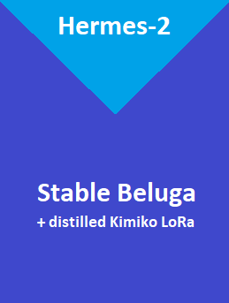

## BlockMerge Gradient

[Credit to TekVenom for the original concept!](https://github.com/TehVenomm/LM_Transformers_BlockMerge)

This script provides a utility to merge two pre-trained language models by blending their layers. This can be useful for creating ensembles of models or combining the strengths of two different models into a singular model. The merger is done based on a specified gradient between the two models.

Unless you have 128 GB RAM, this process will take up a lot of virtual memory. Spread your swapfile over multiple drives for optimal performance.

### Usage

You can run the script using the command:

```bash
python BlockMerge_Gradient.py --model_path1 path_to_first_model --model_path2 path_to_second_model --output_model_path path_for_output
```

### Parser Arguments

- `--model_path1`: The path to the first model. This argument is **required**.
  
- `--model_path2`: The path to the second model. This argument is **required**.

- `--output_model_path`: The path to save the merged model. This argument is **required**.

- `--gradient_start`: The start gradient value. Specifies the starting blending ratio for the second model. Default value is `0.0`.

- `--gradient_end`: The end gradient value. Specifies the ending blending ratio for the second model, with the first model being `(1 - gradient_end)`. Default value is `1.0`.

- `--layer_start`: The start layer for merging. Allows you to specify from which layer the blending should begin. Default value is `0`.

- `--layer_end`: The end layer for merging. Allows you to specify until which layer the blending should occur. Default value is `99`.

- `--max_shard_size`: Specifies the shard size when saving the model. It's useful for handling very large models that need to be split into multiple files. Default value is `"2000MiB"`.

### Example



```bash
python BlockMerge_Gradient.py --model_path1 "stabilityai/StableBeluga-7B" --model_path2 "NousResearch/Nous-Hermes-Llama2-13b" --output_model_path "mythologic-mini-7b" --gradient_start 0.9 --gradient_end 0.0 --layer_start 0 --layer_end 12
```

In this example, layers from the first model (`model_path1`) will start blending from a ratio of `0.2` and end at `0.8` for the final layer, with the second model (`model_path2`) taking the complementary ratio.
